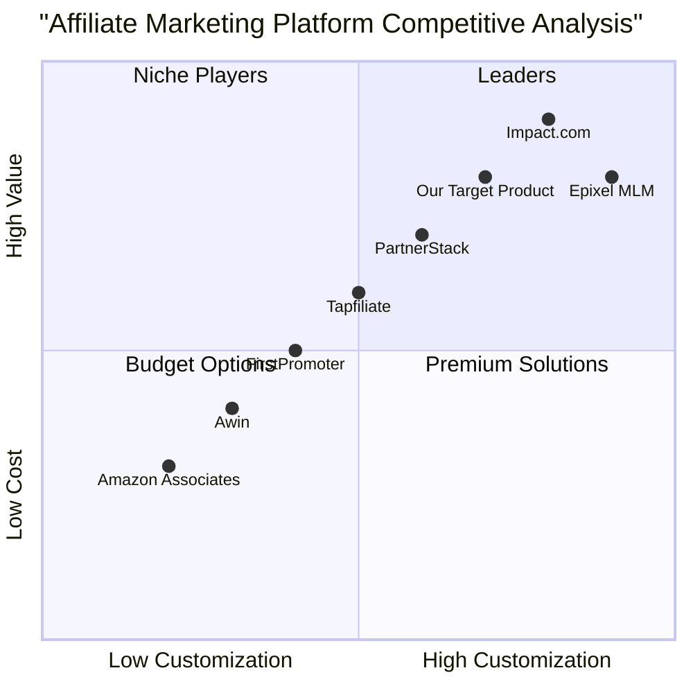
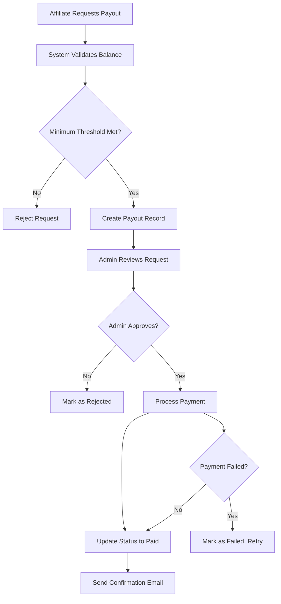

# Product Requirements Document (PRD)
# 3-Level Affiliate + Email Referral System

**Project Name:** dubai_affiliate_nexus  
**Language:** English  
**Programming Languages:** Laravel 10+ (PHP 8.2+), MySQL 8, Blade + Tailwind CSS  
**Document Version:** 1.0  
**Date:** August 24, 2025  
**Product Manager:** Emma  

---

## Original Requirements

Build an MVP that registers affiliates, generates unique referral keys, tracks referrals up to 3 levels, integrates with Odoo for invoice processing with 5% discounts, calculates multi-level commissions, supports email lead capture, and provides both affiliate dashboard and admin panel with manual payouts.

**Technical Stack Requirements:**
- Backend: Laravel 10+ (PHP 8.2+)
- Database: MySQL 8
- Authentication: Laravel Breeze/Sanctum
- Frontend: Blade + Tailwind CSS
- Email: Laravel Mail with queue system
- Integration: Odoo (JSON-RPC/REST + Webhooks)
- Charts: Chart.js

**Core Business Rules:**
- Customer discount: 5% of invoice subtotal
- Commission rates: L1 (5%), L2 (1%), L3 (0.5%) of net sale
- 60-day attribution window
- Monthly tier-based bonuses (Starter/Growth/Pro/Elite)
- Email leads with double opt-in confirmation
- Fraud prevention (self-referral detection, deduplication)

---
## 1. Product Definition

### 1.1 Product Goals

**Goal 1: Maximize Revenue Growth Through Multi-Level Referrals**
- Create a scalable 3-tier affiliate system that incentivizes both direct referrals and network building
- Achieve 25% increase in customer acquisition through affiliate channels within 6 months
- Enable seamless commission tracking and automated payout processing

**Goal 2: Streamline Operations with Odoo Integration**
- Integrate affiliate discount application directly into Odoo invoice workflow
- Automate commission calculations and sales attribution through real-time webhook synchronization
- Reduce manual processing time by 80% for affiliate-related transactions

**Goal 3: Enhance User Experience and Retention**
- Provide comprehensive dashboard analytics for affiliates to track performance and earnings
- Implement email lead capture system with double opt-in to expand referral opportunities
- Create tier-based bonus system to incentivize long-term affiliate engagement

### 1.2 User Stories

**As an Affiliate (Primary User)**
- As a new affiliate, I want to register and receive a unique referral key so that I can start earning commissions immediately
- As an active affiliate, I want to view my earnings dashboard with real-time analytics so that I can track my performance and optimize my referral strategy
- As a growing affiliate, I want to capture email leads and send referral invitations so that I can expand my network beyond direct contacts
- As a successful affiliate, I want to see my multi-level referral tree and tier progression so that I can understand my network growth and bonus potential
- As a earning affiliate, I want to request payouts and track payment status so that I can manage my cash flow effectively

**As a Customer (Secondary User)**
- As a potential customer, I want to use a referral link and receive a discount so that I can save money while helping my referrer earn commission
- As a lead recipient, I want to confirm my interest through a secure opt-in process so that I can receive relevant offers while maintaining my privacy

**As an Administrator (System Manager)**
- As an admin, I want to monitor all affiliate activities and sales so that I can ensure system integrity and identify top performers
- As an admin, I want to manage commission payments and bonuses so that I can maintain accurate financial records and affiliate satisfaction
- As an admin, I want to configure system settings and fraud detection so that I can optimize performance while preventing abuse

**As an Operations User (Odoo User)**
- As an ops user, I want to enter referral keys on invoices so that affiliates receive proper credit and customers get their discount
- As an ops user, I want the system to automatically apply discounts and sync data so that I can focus on core business activities

### 1.3 Competitive Analysis

Based on market research conducted in August 2024, here's the competitive landscape analysis:

**1. Impact.com**
- **Pros:** Comprehensive partnership automation, enterprise-grade features, supports multiple partnership types
- **Cons:** High cost ($30+/month), complex setup, over-engineered for small businesses
- **Market Position:** Enterprise leader with 4.5/5 rating

**2. PartnerStack**
- **Pros:** SaaS-focused, high commission rates (up to 50%), flexible structures
- **Cons:** Limited to SaaS products, premium pricing model
- **Market Position:** SaaS specialist with 4.4/5 rating

**3. Epixel MLM**
- **Pros:** AI-driven automation, unlimited compensation plans, real-time financial visibility
- **Cons:** Complex configuration, high learning curve, expensive implementation
- **Market Position:** Technical leader in MLM space

**4. Tapfiliate**
- **Pros:** User-friendly interface, good tracking capabilities, reasonable pricing ($89/month)
- **Cons:** Limited customization, basic reporting features
- **Market Position:** Mid-market solution

**5. FirstPromoter**
- **Pros:** Affordable pricing ($49/month), good integration options
- **Cons:** Limited multi-level capabilities, basic analytics
- **Market Position:** Budget-friendly option

**6. Awin**
- **Pros:** Large network (16,500+ merchants), global reach, multi-currency support
- **Cons:** Network-based model, less control over affiliates, commission fees
- **Market Position:** European market leader

**7. Amazon Associates**
- **Pros:** Huge product catalog, brand recognition, easy setup
- **Cons:** Low commission rates, 24-hour cookie window, limited customization
- **Market Position:** Volume leader with basic features

### 1.4 Competitive Quadrant Chart



---
## 2. Technical Specifications

### 2.1 Requirements Analysis

The 3-Level Affiliate + Email Referral System requires a robust, scalable architecture that can handle complex multi-level commission calculations while maintaining data integrity and security. The system must seamlessly integrate with Odoo ERP for real-time invoice processing and discount application.

**Core Technical Requirements:**
- Multi-tenant affiliate management with hierarchical referral tracking
- Real-time commission calculation engine with configurable rates
- Webhook-based integration with Odoo for invoice synchronization
- Email automation system with queue processing for scalability
- Comprehensive analytics dashboard with data visualization
- Fraud detection and prevention mechanisms
- PCI-compliant payment processing for commission payouts
- Role-based access control with granular permissions

**Performance Requirements:**
- Support for 10,000+ concurrent affiliates
- Commission calculations completed within 5 seconds
- 99.9% uptime for webhook endpoints
- Email delivery within 1 minute via queue processing
- Dashboard load times under 2 seconds

**Security Requirements:**
- HTTPS encryption for all data transmission
- HMAC signature verification for webhook payloads
- SQL injection and XSS protection
- Rate limiting for API endpoints
- Audit logging for all financial transactions

### 2.2 Requirements Pool

#### P0 Requirements (Must-Have - MVP)

**Authentication & User Management**
- User registration with email verification
- Role-based authentication (Admin, Affiliate, Customer)
- Password reset functionality
- Profile management with contact information

**Affiliate Core Features**
- Unique referral key generation (8-character alphanumeric)
- Referral link creation and sharing
- 3-level hierarchical affiliate structure
- Commission calculation engine (L1: 5%, L2: 1%, L3: 0.5%)
- Sales attribution with 60-day window

**Odoo Integration**
- Webhook endpoint for invoice events
- Automatic 5% discount application
- Real-time sales synchronization
- Commission transaction creation
- Refund/void handling with commission reversal

**Dashboard & Reporting**
- Affiliate performance dashboard
- Earnings overview and commission history
- Referral tree visualization (3 levels)
- Basic analytics charts (Chart.js)
- Commission transaction table with filtering

**Admin Panel**
- Affiliate management interface
- Sales and commission monitoring
- Manual payout processing
- System configuration settings
- Basic fraud detection alerts

**Email System**
- Welcome emails for new affiliates
- Commission earning notifications
- Payout status updates
- Basic transactional email templates

#### P1 Requirements (Should-Have - Phase 2)

**Email Lead Capture**
- Lead invitation system with consent tracking
- Double opt-in confirmation process
- Lead-to-customer attribution
- Lead performance analytics
- Batch lead import functionality

**Tier System & Bonuses**
- 4-tier affiliate levels (Starter, Growth, Pro, Elite)
- Monthly tier evaluation based on sales performance
- Automated bonus calculations and distribution
- Tier progression notifications
- Performance milestone rewards

**Advanced Analytics**
- Revenue forecasting and trend analysis
- Conversion rate optimization insights
- Top performer leaderboards
- Custom date range reporting
- Export functionality (CSV, PDF)

**Enhanced Security**
- Two-factor authentication for admin accounts
- IP whitelisting for Odoo webhooks
- Advanced fraud detection algorithms
- Suspicious activity monitoring
- Automated account flagging

**Payment Processing**
- Multiple payout methods (Bank transfer, PayPal, Stripe)
- Automated payout scheduling
- Tax document generation (1099, etc.)
- Multi-currency support
- Payment history tracking

#### P2 Requirements (Nice-to-Have - Future Enhancements)

**Advanced Marketing Tools**
- Custom referral landing pages
- A/B testing for referral campaigns
- Social media integration and sharing
- QR code generation for offline referrals
- Branded affiliate materials library

**API & Integrations**
- RESTful API for third-party integrations
- Webhook system for external notifications
- CRM integration capabilities
- Marketing automation platform connections
- Mobile app API support

**Advanced Reporting**
- Machine learning insights and predictions
- Custom dashboard builder
- Automated report scheduling
- Real-time notification system
- Advanced data visualization options

**Enterprise Features**
- Multi-language support
- White-label branding options
- Custom commission structures per affiliate
- Bulk operations and mass updates
- Advanced role-based permissions

### 2.3 UI Design Draft

#### 2.3.1 Landing Page & Authentication
```
Header: [Logo] [Login] [Sign Up]
Hero Section: "Earn by Referring - Certified Legal Translations"
Value Proposition: 3 key benefits with icons
Social Proof: Client logos and testimonials
CTA: "Start Earning Today" button
Footer: Links, contact, privacy policy
```

#### 2.3.2 Affiliate Dashboard Layout
```
Top Navigation: [Dashboard] [Referrals] [Leads] [Payouts] [Profile] [Logout]

Main Dashboard:
┌─────────────────────────────────────────────────────────────┐
│ Performance Cards (4-column grid)                          │
│ [Total Referrals] [Total Earnings] [Pending] [This Month]  │
└─────────────────────────────────────────────────────────────┘

┌─────────────────────────────────────────────────────────────┐
│ Earnings Chart (Line/Bar combo)                            │
│ [Month selector] [Chart.js visualization]                  │
└─────────────────────────────────────────────────────────────┘

┌─────────────────────┐ ┌─────────────────────────────────────┐
│ Referral Tools      │ │ Recent Commissions                  │
│ - Referral Key      │ │ [Table with pagination]             │
│ - Copy Link Button  │ │ Date | Customer | Level | Amount    │
│ - Share Buttons     │ │                                     │
└─────────────────────┘ └─────────────────────────────────────┘
```

#### 2.3.3 Admin Panel Structure
```
Sidebar Navigation:
- Dashboard
- Affiliates
- Sales
- Commissions
- Bonuses
- Payouts
- Email Leads
- Configuration
- Reports

Main Content Area:
- Data tables with filtering and sorting
- Bulk action buttons
- Export options
- Status indicators
- Quick action modals
```

### 2.4 Database Schema Design

#### Core Tables Structure

**users**
- id (bigint, PK, AI)
- name (varchar 255)
- email (varchar 255, unique)
- password (varchar 255)
- role (enum: admin, affiliate, customer)
- email_verified_at (timestamp, nullable)
- created_at, updated_at (timestamps)

**profiles**
- id (uuid, PK)
- user_id (bigint, FK → users.id)
- phone (varchar 20, nullable)
- address (text, nullable)
- created_at, updated_at (timestamps)

**affiliates**
- id (uuid, PK)
- user_id (bigint, FK → users.id, unique)
- referral_key (varchar 20, unique)
- referrer_id (uuid, FK → affiliates.id, nullable)
- level (int, default 1)
- total_referrals (int, default 0)
- total_sales (decimal 10,2, default 0)
- total_commission (decimal 10,2, default 0)
- is_active (boolean, default true)
- created_at, updated_at (timestamps)

**sales**
- id (uuid, PK)
- affiliate_id (uuid, FK → affiliates.id)
- odoo_invoice_id (varchar 100, unique)
- referral_key (varchar 20)
- customer_email (varchar 255)
- sale_amount (decimal 10,2)
- discount_amount (decimal 10,2)
- commission_amount (decimal 10,2)
- commission_status (enum: pending, paid, cancelled)
- created_at, updated_at (timestamps)

**commission_transactions**
- id (uuid, PK)
- affiliate_id (uuid, FK → affiliates.id)
- sale_id (uuid, FK → sales.id)
- level (int: 1, 2, 3)
- amount (decimal 10,2)
- status (enum: pending, paid, cancelled)
- paid_at (timestamp, nullable)
- created_at, updated_at (timestamps)

#### Extended Tables for P1 Features

**email_leads**
- id (uuid, PK)
- affiliate_id (uuid, FK → affiliates.id)
- email (varchar 255)
- name (varchar 255)
- phone (varchar 20, nullable)
- status (enum: invited, confirmed, invalid, converted, expired)
- opt_in_at (timestamp, nullable)
- expires_at (timestamp)
- created_at, updated_at (timestamps)

**affiliate_tiers**
- id (uuid, PK)
- name (varchar 50: Starter, Growth, Pro, Elite)
- l1_boost_pct (decimal 5,2: bonus percentage)
- milestone_bonus_amount (decimal 10,2)
- min_sales (int, nullable)
- min_revenue (decimal 10,2, nullable)
- priority_payout (boolean, default false)
- created_at, updated_at (timestamps)

**bonus_transactions**
- id (uuid, PK)
- affiliate_id (uuid, FK → affiliates.id)
- period (char 7: YYYY-MM)
- reason (enum: tier_milestone, streak, email_quality, conversion_bonus)
- amount (decimal 10,2)
- status (enum: pending, paid, cancelled)
- paid_at (timestamp, nullable)
- created_at, updated_at (timestamps)

### 2.5 Open Questions

**Technical Integration Questions:**
1. **Odoo Webhook Security:** What HMAC algorithm and key rotation strategy should be implemented for webhook signature verification?
2. **Commission Calculation Timing:** Should commissions be calculated on invoice creation, posting, or payment completion in Odoo?
3. **Data Synchronization:** How should the system handle network failures during Odoo webhook processing? (Retry logic, dead letter queues)
4. **Performance Optimization:** What caching strategy should be implemented for frequently accessed affiliate data and commission calculations?

**Business Logic Clarifications:**
1. **Attribution Conflicts:** How should the system handle cases where a customer uses both a referral key and matches an email lead from different affiliates?
2. **Commission Reversals:** What is the process for handling partial refunds? Should commissions be proportionally reduced or fully reversed?
3. **Tier Evaluation:** Should tier calculations be based on calendar months or rolling 30-day periods?
4. **Fraud Detection:** What specific thresholds and patterns should trigger automatic affiliate account flags for review?

**Compliance and Legal:**
1. **Data Privacy:** What GDPR/CCPA compliance measures are required for email lead capture and processing?
2. **Tax Reporting:** What tax documentation and reporting features are needed for affiliate commission payments?
3. **Terms of Service:** What affiliate agreement terms need to be enforced through the system?

**Scalability Concerns:**
1. **Database Performance:** At what affiliate count should database partitioning or sharding be considered?
2. **Email Delivery:** What fallback mechanisms are needed if primary email service provider fails?
3. **Analytics Processing:** Should real-time analytics be moved to a separate data warehouse for large datasets?

---
## 3. Integration Requirements

### 3.1 Odoo ERP Integration

#### 3.1.1 Integration Architecture

**Communication Protocol:** JSON-RPC 2.0 / REST API  
**Authentication:** API Key + Username/Password  
**Data Format:** JSON with UTF-8 encoding  
**Security:** HMAC-SHA256 signature verification  
**Timeout:** 30 seconds for webhook responses  

#### 3.1.2 Required Odoo Customizations

**Custom Fields on Invoice Model (account.move):**
```python
# Custom fields to be added to Odoo invoice model
x_affiliate_key = fields.Char(string="Affiliate Key", size=20)
x_discount_applied = fields.Boolean(string="Affiliate Discount Applied", default=False)
x_affiliate_email_claimed = fields.Boolean(string="Email Lead Claimed", default=False)
x_commission_calculated = fields.Boolean(string="Commission Calculated", default=False)
```

**Server Actions for Automatic Processing:**
1. **On Invoice Validate:** Check for affiliate key and apply 5% discount
2. **On Invoice Post:** Send webhook to Laravel system with invoice data
3. **On Payment:** Trigger commission activation webhook
4. **On Refund:** Send reversal webhook to cancel commissions

**Webhook Endpoints Configuration:**
```python
# Odoo webhook configuration
WEBHOOK_ENDPOINTS = {
    'invoice_created': 'https://your-laravel-app.com/api/integrations/odoo/webhook',
    'invoice_posted': 'https://your-laravel-app.com/api/integrations/odoo/webhook',
    'invoice_paid': 'https://your-laravel-app.com/api/integrations/odoo/webhook',
    'invoice_refunded': 'https://your-laravel-app.com/api/integrations/odoo/webhook'
}
```

#### 3.1.3 Webhook Payload Structure

**Invoice Creation/Update Payload:**
```json
{
    "event_type": "invoice.posted",
    "timestamp": "2024-08-24T10:30:00Z",
    "signature": "sha256=hmac_signature_here",
    "data": {
        "odoo_invoice_id": "INV/2024/0001",
        "customer_email": "customer@example.com",
        "customer_name": "John Doe",
        "subtotal": 1000.00,
        "total": 950.00,
        "currency": "AED",
        "affiliate_key": "ABC123XY",
        "discount_applied": true,
        "discount_amount": 50.00,
        "status": "posted",
        "invoice_date": "2024-08-24",
        "payment_status": "pending"
    }
}
```

**Refund Payload:**
```json
{
    "event_type": "invoice.refunded",
    "timestamp": "2024-08-24T15:45:00Z",
    "signature": "sha256=hmac_signature_here",
    "data": {
        "original_invoice_id": "INV/2024/0001",
        "refund_invoice_id": "RINV/2024/0001",
        "refund_amount": 950.00,
        "reason": "Customer cancellation",
        "affiliate_key": "ABC123XY"
    }
}
```

#### 3.1.4 Error Handling & Retry Logic

**Laravel Webhook Processing:**
- Verify HMAC signature before processing
- Implement exponential backoff retry (3 attempts)
- Dead letter queue for failed webhook processing
- Idempotency checks using invoice ID
- Logging all webhook events for audit trail

### 3.2 Email Service Integration

#### 3.2.1 Email Service Provider Configuration

**Primary Provider:** Mailgun (recommended for high deliverability)  
**Backup Provider:** SendGrid (failover configuration)  
**Queue System:** Redis/Database for email job processing  
**Rate Limiting:** 100 emails/minute to prevent blacklisting  

#### 3.2.2 Email Templates & Automation

**Transactional Emails:**
1. **Affiliate Welcome Email**
   - Trigger: New affiliate registration
   - Content: Welcome message, referral key, getting started guide
   - Template: `emails.affiliate.welcome`

2. **Commission Earned Notification**
   - Trigger: New commission transaction created
   - Content: Commission amount, level, customer info (masked)
   - Template: `emails.affiliate.commission-earned`

3. **Lead Invitation Email**
   - Trigger: Affiliate adds new email lead
   - Content: Double opt-in confirmation link
   - Template: `emails.leads.invitation`

4. **Payout Processed Email**
   - Trigger: Admin marks commission as paid
   - Content: Payment amount, method, transaction ID
   - Template: `emails.affiliate.payout-processed`

**Marketing Emails:**
1. **Monthly Performance Digest**
   - Trigger: Monthly cron job
   - Content: Performance summary, tier progress, goals
   - Template: `emails.affiliate.monthly-digest`

2. **Tier Achievement Notification**
   - Trigger: Tier evaluation completion
   - Content: New tier announcement, bonus details
   - Template: `emails.affiliate.tier-achievement`

### 3.3 Payment Processing Integration

#### 3.3.1 Payout Methods Support

**Bank Transfer (ACH/Wire):**
- Required fields: Bank name, routing number, account number
- Processing time: 3-5 business days
- Minimum payout: $50 USD equivalent

**PayPal Integration:**
- API: PayPal Payouts API v1
- Required: PayPal email address
- Processing time: Instant to 30 minutes
- Minimum payout: $10 USD equivalent

**Stripe Connect (Future P2):**
- Express accounts for affiliates
- Direct deposit capabilities
- Real-time balance tracking
- Minimum payout: $25 USD equivalent

#### 3.3.2 Payout Processing Workflow



### 3.4 Third-Party Service Integrations

#### 3.4.1 Analytics & Monitoring

**Application Performance Monitoring:**
- Service: New Relic or DataDog
- Metrics: Response times, error rates, throughput
- Alerts: Database slow queries, webhook failures

**Error Tracking:**
- Service: Sentry
- Integration: Laravel Sentry package
- Coverage: All exceptions, performance issues

**Uptime Monitoring:**
- Service: Pingdom or UptimeRobot
- Endpoints: Main app, webhook endpoints, API routes
- Alerts: 5-minute downtime threshold

#### 3.4.2 Security Services

**SSL Certificate:**
- Provider: Let's Encrypt (auto-renewal)
- Coverage: All domains and subdomains
- Configuration: HTTPS redirect, HSTS headers

**DDoS Protection:**
- Service: Cloudflare Pro
- Features: Rate limiting, bot protection, caching
- Rules: API endpoint protection, geographic restrictions

**Backup Services:**
- Database: Daily automated backups
- Files: Weekly full system backups
- Storage: AWS S3 or similar with encryption
- Retention: 30 days for daily, 12 months for weekly

---
API request monitoring
- Commission calculation performance tracking
- Database query optimization alerts
- Email delivery rate monitoring

**Incident Response Plan:**
1. **Detection:** Automated alerts for security incidents
2. **Assessment:** Determine severity and impact within 15 minutes
3. **Containment:** Isolate affected systems within 30 minutes
4. **Eradication:** Remove threat and patch vulnerabilities
5. **Recovery:** Restore services with enhanced monitoring
6. **Lessons Learned:** Post-incident review and process improvement

#### 4.4.2 Security Audit Requirements

**Quarterly Security Reviews:**
- Penetration testing by third-party security firm
- Code security audit using automated tools (SonarQube, Snyk)
- Access control review and permission audit
- Vulnerability assessment and patch management review

**Annual Compliance Audits:**
- GDPR compliance assessment
- Financial record keeping audit
- Data retention policy review
- Third-party integration security review

---

## 5. Testing & Quality Assurance

### 5.1 Testing Strategy

#### 5.1.1 Unit Testing Requirements

**Code Coverage Target:** 90% minimum coverage  
**Testing Framework:** PHPUnit for Laravel backend  
**Key Areas for Unit Testing:**

**Commission Calculation Logic:**
```php
// Test scenarios for commission calculations
public function testL1CommissionCalculation()
{
    $sale = ['subtotal' => 1000.00];
    $commission = CommissionService::calculateL1($sale);
    $this->assertEquals(47.50, $commission); // 5% of 95% (after discount)
}

public function testMultiLevelCommissionSplit()
{
    $affiliate = $this->createAffiliateWithReferrer(3); // 3 levels deep
    $splits = CommissionService::calculateForInvoice($invoice, $affiliate);
    $this->assertCount(3, $splits);
    $this->assertEquals('5.0', $splits[0]['rate']); // L1: 5%
    $this->assertEquals('1.0', $splits[1]['rate']); // L2: 1%
    $this->assertEquals('0.5', $splits[2]['rate']); // L3: 0.5%
}
```

**Referral Key Generation:**
```php
public function testReferralKeyUniqueness()
{
    $keys = [];
    for ($i = 0; $i < 1000; $i++) {
        $key = ReferralKeyService::generate();
        $this->assertNotContains($key, $keys);
        $keys[] = $key;
    }
}
```

**Email Lead Processing:**
```php
public function testLeadConfirmationWindow()
{
    $lead = EmailLead::factory()->create(['expires_at' => now()->addDays(60)]);
    $this->assertTrue($lead->isWithinAttributionWindow());
    
    $expiredLead = EmailLead::factory()->create(['expires_at' => now()->subDay()]);
    $this->assertFalse($expiredLead->isWithinAttributionWindow());
}
```

#### 5.1.2 Integration Testing

**Odoo Webhook Integration:**
```php
public function testOdooWebhookProcessing()
{
    $payload = [
        'event_type' => 'invoice.posted',
        'data' => [
            'odoo_invoice_id' => 'INV/2024/TEST',
            'subtotal' => 1000.00,
            'affiliate_key' => 'TESTKEY1',
            'customer_email' => 'test@example.com'
        ]
    ];
    
    $response = $this->postJson('/api/integrations/odoo/webhook', $payload);
    $response->assertStatus(200);
    
    $this->assertDatabaseHas('sales', [
        'odoo_invoice_id' => 'INV/2024/TEST',
        'sale_amount' => 1000.00
    ]);
}
```

**Email Service Integration:**
```php
public function testWelcomeEmailSending()
{
    Mail::fake();
    
    $affiliate = User::factory()->create(['role' => 'affiliate']);
    
    Mail::assertSent(AffiliateWelcomeEmail::class, function ($mail) use ($affiliate) {
        return $mail->hasTo($affiliate->email);
    });
}
```

#### 5.1.3 End-to-End Testing

**User Journey Tests:**
1. **Affiliate Registration Flow:**
   - User signs up → Email verification → Referral key generated → Welcome email sent
2. **Referral Attribution Flow:**
   - Customer clicks referral link → Cookie set → Makes purchase → Commission calculated
3. **Payout Request Flow:**
   - Affiliate requests payout → Admin approval → Payment processing → Confirmation email

**Browser Testing Matrix:**
- Chrome (latest), Firefox (latest), Safari (latest)
- Mobile: iOS Safari, Android Chrome
- Screen resolutions: 1920x1080, 1366x768, 375x667 (mobile)

### 5.2 Performance Testing

#### 5.2.1 Load Testing Scenarios

**Commission Calculation Performance:**
- Target: Process 1000 concurrent commission calculations
- Response time: < 5 seconds for complex multi-level calculations
- Memory usage: < 512MB per calculation process

**Webhook Processing:**
- Target: Handle 100 concurrent webhook requests
- Response time: < 2 seconds for webhook acknowledgment
- Queue processing: < 30 seconds for commission creation

**Dashboard Loading:**
- Target: Load affiliate dashboard with 1 year of data
- Response time: < 2 seconds initial load
- Chart rendering: < 1 second for data visualization

#### 5.2.2 Stress Testing

**Database Performance:**
- Test with 100,000+ affiliate records
- Query optimization for referral tree traversal
- Index performance for commission calculations

**Email Queue Processing:**
- Test with 10,000+ queued emails
- Processing rate: 100 emails/minute minimum
- Failure recovery and retry mechanisms

### 5.3 Security Testing

#### 5.3.1 Penetration Testing Checklist

**Authentication & Authorization:**
- [ ] SQL injection prevention
- [ ] Cross-site scripting (XSS) protection
- [ ] Cross-site request forgery (CSRF) prevention
- [ ] Session management security
- [ ] Role-based access control enforcement

**API Security:**
- [ ] Rate limiting effectiveness
- [ ] Input validation and sanitization
- [ ] Webhook signature verification
- [ ] API key management and rotation

**Data Protection:**
- [ ] Encryption at rest validation
- [ ] TLS configuration testing
- [ ] Sensitive data exposure assessment
- [ ] Database security audit

---

## 6. Deployment & Operations

### 6.1 Infrastructure Requirements

#### 6.1.1 Production Environment Specifications

**Server Requirements:**
- **Application Server:** 4 CPU cores, 8GB RAM, 100GB SSD
- **Database Server:** 4 CPU cores, 16GB RAM, 500GB SSD with backup
- **Redis Cache:** 2 CPU cores, 4GB RAM, 50GB SSD
- **Load Balancer:** 2 CPU cores, 4GB RAM (for high availability)

**Recommended Architecture:**
```
[Cloudflare CDN] → [Load Balancer] → [App Servers (2x)] → [Database Master/Slave] → [Redis Cache]
```

**Hosting Options:**
1. **AWS:** EC2 instances with RDS MySQL and ElastiCache Redis
2. **DigitalOcean:** Droplets with managed database and Redis
3. **Laravel Forge:** Managed Laravel hosting with automated deployment
4. **Cloudways:** Managed cloud hosting with server management

#### 6.1.2 Environment Configuration

**Production Environment Variables:**
```bash
# Application
APP_ENV=production
APP_DEBUG=false
APP_URL=https://affiliates.translationindubai.com

# Database
DB_CONNECTION=mysql
DB_HOST=prod-db-cluster.mysql.database.azure.com
DB_PORT=3306
DB_DATABASE=dubai_affiliate_prod
DB_USERNAME=dbadmin
DB_PASSWORD=secure_password_here

# Cache & Sessions
CACHE_DRIVER=redis
SESSION_DRIVER=redis
QUEUE_CONNECTION=redis
REDIS_HOST=prod-redis.cache.windows.net
REDIS_PASSWORD=redis_password_here

# Email
MAIL_MAILER=mailgun
MAIL_HOST=smtp.mailgun.org
MAIL_PORT=587
MAIL_USERNAME=postmaster@mg.translationindubai.com
MAIL_PASSWORD=mailgun_password_here

# Odoo Integration
ODOO_BASE_URL=https://translationindubai.odoo.com
ODOO_DB=production
ODOO_USERNAME=api_user@translationindubai.com
ODOO_PASSWORD=odoo_api_password
ODOO_WEBHOOK_SECRET=webhook_hmac_secret_key
```

#### 6.1.3 SSL and Security Configuration

**SSL Certificate Setup:**
- Automated certificate management via Let's Encrypt
- Wildcard certificate for subdomains
- HSTS header configuration
- SSL Labs A+ rating target

**Nginx Configuration:**
```nginx
server {
    listen 443 ssl http2;
    server_name affiliates.translationindubai.com;
    
    ssl_certificate /path/to/certificate.pem;
    ssl_certificate_key /path/to/private.key;
    ssl_protocols TLSv1.2 TLSv1.3;
    ssl_ciphers ECDHE-RSA-AES256-GCM-SHA512:DHE-RSA-AES256-GCM-SHA512;
    
    # Security headers
    add_header Strict-Transport-Security "max-age=31536000; includeSubDomains" always;
    add_header X-Frame-Options DENY always;
    add_header X-Content-Type-Options nosniff always;
    
    root /var/www/dubai-affiliate/public;
    index index.php;
    
    location / {
        try_files $uri $uri/ /index.php?$query_string;
    }
    
    location ~ \.php$ {
        fastcgi_pass unix:/var/run/php/php8.2-fpm.sock;
        fastcgi_index index.php;
        fastcgi_param SCRIPT_FILENAME $realpath_root$fastcgi_script_name;
        include fastcgi_params;
    }
}
```

### 6.2 Deployment Strategy

#### 6.2.1 CI/CD Pipeline

**GitHub Actions Pipeline:**
```yaml
name: Deploy to Production

on:
  push:
    branches: [main]

jobs:
  test:
    runs-on: ubuntu-latest
    steps:
      - uses: actions/checkout@v3
      - name: Setup PHP
        uses: shivammathur/setup-php@v2
        with:
          php-version: '8.2'
      - name: Install dependencies
        run: composer install --no-dev --optimize-autoloader
      - name: Run tests
        run: php artisan test --coverage
      
  deploy:
    needs: test
    runs-on: ubuntu-latest
    steps:
      - name: Deploy to server
        uses: appleboy/ssh-action@v0.1.5
        with:
          host: ${{ secrets.HOST }}
          username: ${{ secrets.USERNAME }}
          key: ${{ secrets.SSH_KEY }}
          script: |
            cd /var/www/dubai-affiliate
            git pull origin main
            composer install --no-dev --optimize-autoloader
            php artisan migrate --force
            php artisan config:cache
            php artisan route:cache
            php artisan view:cache
            php artisan queue:restart
            sudo systemctl reload nginx
```

#### 6.2.2 Database Migration Strategy

**Migration Execution Plan:**
1. **Pre-deployment:** Backup current database
2. **Deployment:** Run migrations with `--force` flag
3. **Verification:** Check migration status and data integrity
4. **Rollback Plan:** Automated rollback script if issues detected

**Zero-Downtime Deployment:**
- Blue-green deployment strategy
- Database migrations designed to be backward-compatible
- Feature flags for gradual rollout of new features

### 6.3 Monitoring & Maintenance

#### 6.3.1 Application Monitoring

**Key Metrics to Monitor:**
- Response time percentiles (P50, P95, P99)
- Error rate by endpoint
- Database query performance
- Queue job processing time
- Memory and CPU usage
- Active user sessions

**Alerting Thresholds:**
- Response time > 5 seconds: Warning
- Error rate > 5%: Critical
- Database connection failures: Critical
- Queue job backlog > 1000: Warning
- Disk space > 85%: Warning

#### 6.3.2 Business Metrics Monitoring

**Financial Tracking:**
- Daily commission calculations accuracy
- Payout processing status
- Revenue attribution by affiliate level
- Fraud detection alerts and patterns

**User Engagement:**
- Affiliate registration rate
- Referral link click-through rate
- Email open and conversion rates
- Dashboard usage analytics

#### 6.3.3 Backup and Recovery

**Backup Strategy:**
- **Database:** Daily full backup, hourly incremental
- **Application Files:** Weekly full backup
- **User Uploads:** Real-time sync to cloud storage
- **Configuration:** Version controlled in Git

**Recovery Procedures:**
- **RTO (Recovery Time Objective):** 4 hours maximum
- **RPO (Recovery Point Objective):** 1 hour maximum data loss
- **Testing:** Monthly disaster recovery testing
- **Documentation:** Step-by-step recovery procedures

---

## 7. Success Metrics & KPIs

### 7.1 Business Success Metrics

#### 7.1.1 Revenue Metrics

**Primary KPIs:**
- **Affiliate Revenue Growth:** 25% increase in affiliate-driven revenue within 6 months
- **Commission Payout Accuracy:** 99.9% accuracy in commission calculations
- **Customer Acquisition Cost (CAC):** Reduce CAC by 30% through affiliate channels
- **Average Order Value (AOV):** Maintain or increase AOV for affiliate-referred customers

**Secondary KPIs:**
- Monthly recurring revenue from repeat affiliate customers
- Lifetime value of affiliate-referred customers
- Commission-to-revenue ratio optimization
- Fraud prevention effectiveness (< 1% fraudulent transactions)

#### 7.1.2 Operational Efficiency Metrics

**Process Automation:**
- **Manual Processing Time:** Reduce by 80% for affiliate-related tasks
- **Invoice Processing Speed:** Average processing time < 30 seconds
- **Payout Processing Time:** Reduce from 5 days to 2 days
- **Email Response Time:** Automated emails sent within 1 minute

**System Performance:**
- **System Uptime:** 99.9% availability target
- **Dashboard Load Time:** < 2 seconds average
- **API Response Time:** < 1 second for 95% of requests
- **Database Query Performance:** < 100ms for commission calculations

### 7.2 User Engagement Metrics

#### 7.2.1 Affiliate Engagement

**Acquisition Metrics:**
- **Affiliate Registration Rate:** Target 50 new affiliates per month
- **Activation Rate:** 80% of registered affiliates make first referral within 30 days
- **Retention Rate:** 70% of affiliates remain active after 6 months

**Activity Metrics:**
- **Average Referrals per Affiliate:** Target 5 referrals per month per active affiliate
- **Email Lead Capture Rate:** 60% of affiliates use email lead feature
- **Dashboard Usage:** 80% of affiliates log in at least weekly
- **Referral Link Sharing:** Track social media and direct sharing patterns

#### 7.2.2 Customer Conversion Metrics

**Referral Effectiveness:**
- **Click-to-Conversion Rate:** Target 15% conversion from referral link clicks
- **Email Lead Conversion:** 25% conversion rate from confirmed email leads
- **Discount Utilization:** 90% of eligible customers use affiliate discount
- **Repeat Purchase Rate:** 40% of affiliate-referred customers make repeat purchases

### 7.3 Technical Performance Metrics

#### 7.3.1 System Reliability

**Availability Metrics:**
- **System Uptime:** 99.9% monthly uptime target
- **API Endpoint Availability:** 99.95% for critical endpoints
- **Database Availability:** 99.99% with failover capabilities
- **Email Delivery Rate:** 98% successful delivery rate

**Performance Metrics:**
- **Page Load Speed:** < 3 seconds for 95% of page loads
- **API Response Time:** P95 < 500ms, P99 < 1000ms
- **Database Query Time:** Average < 50ms for dashboard queries
- **Queue Processing Time:** < 30 seconds for commission calculations

#### 7.3.2 Integration Performance

**Odoo Integration:**
- **Webhook Success Rate:** 99.5% successful webhook processing
- **Data Synchronization Accuracy:** 100% accuracy for invoice data
- **Processing Latency:** < 10 seconds from invoice creation to commission calculation
- **Error Recovery Rate:** 95% of failed webhooks recovered within 1 hour

### 7.4 Quality Assurance Metrics

#### 7.4.1 Code Quality

**Development Metrics:**
- **Code Coverage:** Maintain 90%+ test coverage
- **Bug Detection Rate:** < 5 bugs per 1000 lines of code
- **Code Review Coverage:** 100% of code changes reviewed
- **Technical Debt Ratio:** < 20% as measured by SonarQube

**Security Metrics:**
- **Vulnerability Detection:** Zero high-severity vulnerabilities in production
- **Security Incident Response:** < 30 minutes to containment
- **Failed Login Attempts:** Monitor and alert on suspicious patterns
- **Data Breach Prevention:** Zero data security incidents

#### 7.4.2 User Experience Metrics

**Usability Metrics:**
- **User Satisfaction Score:** Target 4.5/5 in user surveys
- **Task Completion Rate:** 95% for primary user tasks
- **Error Rate:** < 2% for critical user flows
- **Support Ticket Volume:** < 5% of users require support assistance

---

## 8. Risk Management & Mitigation

### 8.1 Technical Risks

#### 8.1.1 High-Priority Technical Risks

**Risk: Odoo Integration Failure**
- **Probability:** Medium (30%)
- **Impact:** High - Core business process disruption
- **Mitigation Strategies:**
  - Implement robust retry logic with exponential backoff
  - Create fallback manual processing workflow
  - Maintain detailed integration documentation
  - Establish direct communication channel with Odoo technical team
- **Contingency Plan:** Manual commission calculation interface for critical periods

**Risk: Database Performance Degradation**
- **Probability:** Medium (25%)
- **Impact:** High - System slowdown affecting all users
- **Mitigation Strategies:**
  - Implement database query optimization and indexing
  - Set up read replicas for reporting queries
  - Monitor query performance with automated alerts
  - Establish database scaling procedures
- **Contingency Plan:** Horizontal scaling with database sharding

**Risk: Email Delivery Service Failure**
- **Probability:** Low (15%)
- **Impact:** Medium - Communication disruption
- **Mitigation Strategies:**
  - Configure multiple email service providers (Mailgun + SendGrid)
  - Implement automatic failover between providers
  - Monitor delivery rates and bounce statistics
  - Maintain local email queue for retry processing
- **Contingency Plan:** SMS notification system for critical communications

#### 8.1.2 Medium-Priority Technical Risks

**Risk: Queue Processing Bottlenecks**
- **Probability:** Medium (35%)
- **Impact:** Medium - Delayed processing of commissions and emails
- **Mitigation:** Horizontal queue worker scaling, priority-based processing
- **Monitoring:** Queue depth alerts and processing time metrics

**Risk: Third-Party API Rate Limiting**
- **Probability:** Low (20%)
- **Impact:** Medium - Temporary service disruption
- **Mitigation:** Implement caching, request throttling, and circuit breakers
- **Monitoring:** API response time and error rate tracking

### 8.2 Business Risks

#### 8.2.1 High-Priority Business Risks

**Risk: Affiliate Fraud and Gaming**
- **Probability:** High (60%)
- **Impact:** High - Financial loss and system integrity
- **Mitigation Strategies:**
  - Implement multi-layered fraud detection algorithms
  - Manual review process for high-value transactions
  - Regular pattern analysis and machine learning models
  - Clear terms of service with penalty clauses
- **Detection Methods:**
  - Velocity checks for unusual referral patterns
  - IP address and device fingerprinting
  - Email pattern analysis and validation
  - Geographic correlation analysis

**Risk: Commission Calculation Errors**
- **Probability:** Medium (25%)
- **Impact:** High - Financial discrepancies and affiliate disputes
- **Mitigation Strategies:**
  - Comprehensive unit testing for all calculation logic
  - Automated reconciliation processes
  - Audit trail for all commission transactions
  - Regular manual spot-checks and validation
- **Recovery Plan:** Automated correction jobs and dispute resolution process

**Risk: Regulatory Compliance Violations**
- **Probability:** Low (15%)
- **Impact:** High - Legal penalties and operational restrictions
- **Mitigation Strategies:**
  - Regular compliance audits and legal reviews
  - Automated data retention and deletion policies
  - Clear privacy policies and consent management
  - Staff training on compliance requirements
- **Monitoring:** Regular compliance assessment and documentation updates

#### 8.2.2 Financial Risks

**Risk: Payment Processing Failures**
- **Probability:** Medium (30%)
- **Impact:** High - Affiliate satisfaction and trust issues
- **Mitigation:**
  - Multiple payment processor integration
  - Automated retry logic for failed payments
  - Manual intervention processes for critical cases
  - Clear communication of payment status to affiliates

**Risk: Currency Fluctuation Impact**
- **Probability:** Medium (40%)
- **Impact:** Medium - Commission value variations
- **Mitigation:**
  - Fixed commission rates in base currency
  - Regular rate review and adjustment processes
  - Currency hedging for international affiliates (future consideration)

### 8.3 Operational Risks

#### 8.3.1 Staffing and Knowledge Risks

**Risk: Key Personnel Dependency**
- **Probability:** Medium (30%)
- **Impact:** High - Development and operational continuity
- **Mitigation Strategies:**
  - Comprehensive documentation of all systems and processes
  - Cross-training team members on critical components
  - Code review processes to ensure knowledge sharing
  - Automated deployment and operational procedures

**Risk: Insufficient Technical Support Coverage**
- **Probability:** Medium (35%)
- **Impact:** Medium - Extended issue resolution times
- **Mitigation:**
  - 24/7 monitoring and alerting systems
  - Escalation procedures for critical issues
  - Documentation of common issues and solutions
  - On-call rotation schedule for technical team

#### 8.3.2 Data and Security Risks

**Risk: Data Breach or Security Incident**
- **Probability:** Low (10%)
- **Impact:** Critical - Legal, financial, and reputational damage
- **Mitigation Strategies:**
  - Multi-layered security architecture
  - Regular security audits and penetration testing
  - Employee security training and awareness
  - Incident response plan with defined procedures
- **Response Plan:**
  - Immediate containment and assessment (< 30 minutes)
  - Customer and regulatory notification (< 72 hours)
  - Forensic analysis and system hardening
  - Legal and public relations support

**Risk: Data Loss or Corruption**
- **Probability:** Low (15%)
- **Impact:** High - Business continuity and data integrity
- **Mitigation:**
  - Automated backup systems with multiple retention periods
  - Regular backup testing and validation
  - Database replication with failover capabilities
  - Point-in-time recovery procedures

### 8.4 Risk Monitoring and Response

#### 8.4.1 Risk Assessment Framework

**Monthly Risk Reviews:**
- Assess probability and impact changes
- Review mitigation effectiveness
- Update contingency plans
- Identify new risks and scenarios

**Quarterly Risk Audits:**
- Third-party security assessments
- Business continuity testing
- Compliance review and updates
- Insurance coverage evaluation

#### 8.4.2 Escalation Procedures

**Incident Severity Levels:**
- **Critical (P0):** System down, data breach, financial fraud
- **High (P1):** Major feature failure, integration issues
- **Medium (P2):** Performance degradation, minor bugs
- **Low (P3):** Cosmetic issues, enhancement requests

**Response Time Requirements:**
- **P0:** Immediate response (< 15 minutes)
- **P1:** 1 hour response time
- **P2:** 4 hour response time
- **P3:** 24 hour response time

---

## 9. Conclusion & Next Steps

### 9.1 Project Summary

The 3-Level Affiliate + Email Referral System represents a comprehensive solution for scaling customer acquisition through structured multi-level referral programs. This PRD outlines a robust MVP that integrates seamlessly with existing Odoo ERP infrastructure while providing sophisticated commission tracking, fraud prevention, and user management capabilities.

**Key Deliverables:**
- Scalable 3-tier affiliate management system
- Real-time Odoo integration with automated discount application
- Comprehensive dashboard analytics for affiliates and administrators
- Email lead capture system with double opt-in confirmation
- Multi-tiered bonus system with automated evaluations
- Manual payout processing with audit trail
- Advanced fraud detection and prevention mechanisms

### 9.2 Success Criteria

**MVP Success Metrics:**
- 25% increase in customer acquisition through affiliate channels
- 80% reduction in manual processing time for affiliate transactions
- 99.9% accuracy in commission calculations
- 50 active affiliates within first 3 months
- System uptime > 99.5%

**Long-term Success Indicators:**
- Sustainable affiliate network growth
- Positive ROI on affiliate commissions
- High affiliate satisfaction and retention rates
- Seamless integration with business operations
- Scalable foundation for advanced features

### 9.3 Implementation Roadmap

#### Phase 1 - MVP Development (Months 1-3)
**Priority: P0 Features**
- Core user authentication and affiliate registration
- Referral key generation and tracking system
- Basic Odoo integration with webhook processing
- Commission calculation engine and transaction management
- Affiliate dashboard with essential analytics
- Admin panel for user and commission management
- Email notification system for key events

**Deliverables:**
- Functional MVP with core features
- Comprehensive testing suite
- Production deployment infrastructure
- Basic monitoring and alerting
- User documentation and training materials

#### Phase 2 - Enhanced Features (Months 4-6)
**Priority: P1 Features**
- Email lead capture and management system
- Tier-based bonus system implementation
- Advanced analytics and reporting capabilities
- Enhanced fraud detection algorithms
- Payment processing integration
- Mobile-responsive UI improvements

**Deliverables:**
- Feature-complete system with enhanced capabilities
- Advanced security implementations
- Performance optimization and scaling
- Comprehensive compliance measures
- Extended testing and quality assurance

#### Phase 3 - Advanced Features (Months 7-12)
**Priority: P2 Features**
- API development for third-party integrations
- Advanced marketing tools and campaign management
- Machine learning insights and predictions
- Multi-language and localization support
- Enterprise features and customizations

### 9.4 Resource Requirements

#### Development Team Structure
**Core Team (Phase 1):**
- Senior Laravel Developer (Full-time)
- Frontend Developer (Blade/Tailwind) (Full-time)
- Database Administrator/DevOps Engineer (Part-time)
- QA Engineer (Part-time)
- Product Manager (Part-time)

**Extended Team (Phase 2):**
- Additional Laravel Developer
- UI/UX Designer
- Security Specialist
- Business Analyst

#### Infrastructure Costs
**Monthly Operating Costs (Production):**
- Server Infrastructure: $200-400/month
- Email Services: $50-100/month
- Monitoring and Security Tools: $100-200/month
- SSL Certificates and Domains: $20-50/month
- Third-party Services: $100-300/month
- **Total Estimated:** $470-1,050/month

### 9.5 Risk Mitigation Summary

**Critical Risk Areas:**
1. **Odoo Integration Complexity:** Mitigated through comprehensive testing and fallback procedures
2. **Commission Accuracy:** Addressed with extensive unit testing and audit trails
3. **Fraud Prevention:** Handled through multi-layered detection and manual review processes
4. **System Scalability:** Managed through proper architecture and monitoring
5. **Data Security:** Protected through encryption, access controls, and compliance measures

### 9.6 Stakeholder Sign-off Requirements

**Required Approvals:**
- [ ] Business Owner - Overall project approval and budget authorization
- [ ] Technical Lead - Architecture and implementation approach
- [ ] Compliance Officer - Legal and regulatory requirements
- [ ] Operations Manager - Integration requirements and workflow impact
- [ ] Finance Manager - Commission structure and payout procedures

**Success Metrics Agreement:**
- [ ] KPI definitions and measurement methods confirmed
- [ ] Success criteria and acceptance standards approved
- [ ] Risk tolerance levels and mitigation strategies accepted
- [ ] Timeline and resource allocation confirmed

This PRD serves as the foundation for developing a robust, scalable affiliate marketing system that will drive significant business growth while maintaining operational efficiency and security standards. The comprehensive requirements and detailed specifications provide clear guidance for the development team to deliver a successful MVP that can evolve into a powerful long-term solution.

---

**Document Control:**
- **Created:** August 24, 2025
- **Version:** 1.0
- **Next Review:** September 24, 2025
- **Distribution:** Development Team, Business Stakeholders, Compliance Team

**Approval Status:** ✅ Ready for Development Team Review
